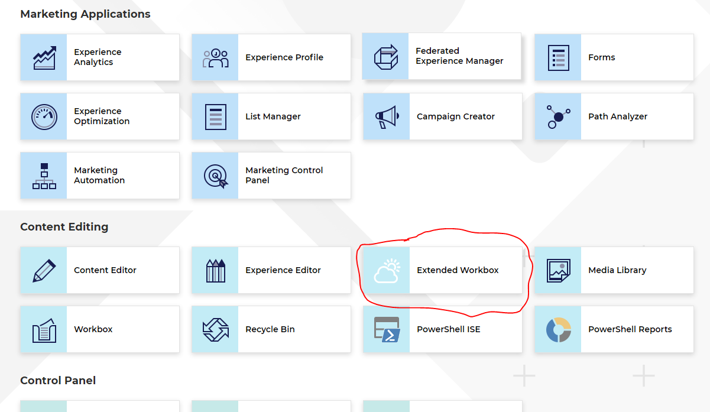
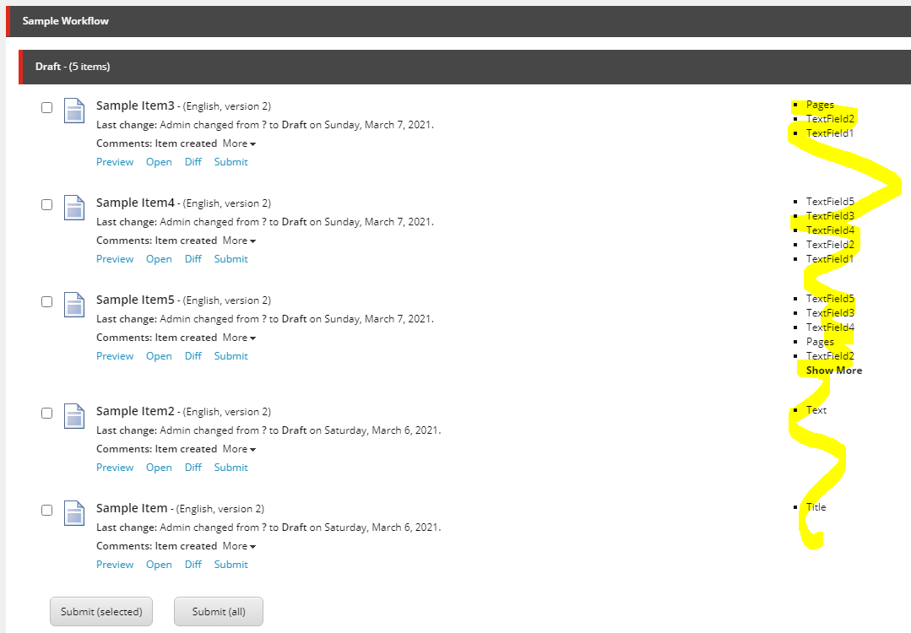

# Hackathon Submission Entry form

> __Important__  
> 
> Copy and paste the content of this file into README.md or face automatic __disqualification__  
> All headlines and subheadlines shall be retained if not noted otherwise.  
> Fill in text in each section as instructed and then delete the existing text, including this blockquote.

You can find a very good reference to Github flavoured markdown reference in [this cheatsheet](https://github.com/adam-p/markdown-here/wiki/Markdown-Cheatsheet). If you want something a bit more WYSIWYG for editing then could use [StackEdit](https://stackedit.io/app) which provides a more user friendly interface for generating the Markdown code. Those of you who are [VS Code fans](https://code.visualstudio.com/docs/languages/markdown#_markdown-preview) can edit/preview directly in that interface too.

We included 2 separeate improvements here. First is main module and second - just appendix.

## Team name
**_Jäger masters_**

## Category
**_The best enhancement to the Sitecore Admin (XP) for Content Editors & Marketers_**

Appendix:
**_Best use of Headless using JSS or .NET_**

## Description
The pourpose of this module is to improve Content Approver experience while using Workbox.

Content Approver can make faster decicion about items approval. This especialy important when they dealing with big amount of itema in workbox

Appendix:
Just simple improvement for JSS solution that makes front-end developer life bit easier :-) while selecting pages in Lookup fields (Like Droplink or Multilist)

## Video link
⟹ Provide a video highlighing your Hackathon module submission and provide a link to the video. You can use any video hosting, file share or even upload the video to this repository. _Just remember to update the link below_

⟹ [Replace this Video link](#video-link)

## Installation instructions

1. Sitecore Package file from [root]\SitecorePackages folder
2. Open solution in Visual Studio and run build
3. Publish (Deploy) Project to Sitecore using VS publish tool

## Usage instructions
Modify several Sample Items (or any other items which have workflow assigned) in 2nd (or more) version of item

Go to launchpad and click on Extended Workbox tile

In main workbox view you can see all fields which were changed per Item without oppening Diff window

Include screenshots where necessary. You can add images to the `./images` folder and then link to them from your documentation:

You can embed images of different formats too:

And you can embed external images too:

## Comments
If you'd like to make additional comments that is important for your module entry.
