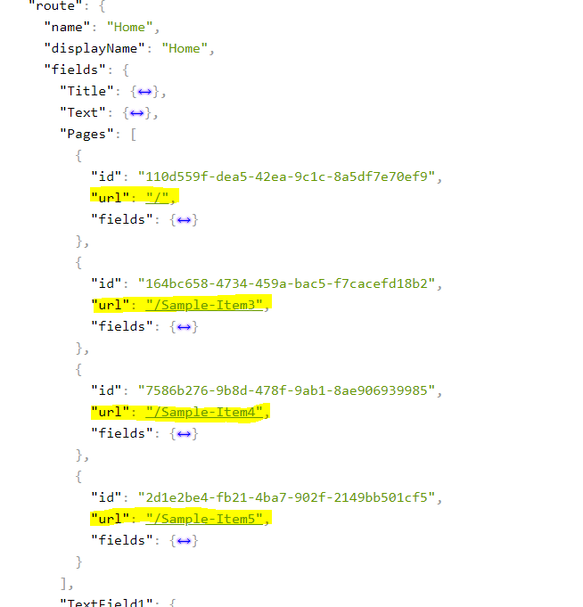

# Hackathon Submission Entry form

We included 2 separeate improvements here. First is main module and second - just appendix.

## Team name
**_Jäger masters_**

## Category
**_The best enhancement to the Sitecore Admin (XP) for Content Editors & Marketers_**

Appendix:
**_Best use of Headless using JSS or .NET_**

## Description
The pourpose of this module is to improve Content Approver experience while using Workbox.

Content Approver can make faster decicion about items approval. This especialy important when they dealing with big amount of items in workbox

Appendix:
Just simple improvement for JSS solution that makes front-end developer life bit easier :-) while selecting pages in Lookup fields (Like Droplink or Multilist)

## Video link
https://youtu.be/TrsgFOfExyc

## Installation instructions

1. Sitecore Package file from [root]\SitecorePackages folder
2. Open solution in Visual Studio and run build
3. Publish (Deploy) Project to Sitecore using VS publish tool

## Usage instructions
Modify several Sample Items (or any other items which have workflow assigned) in 2nd (or more) version of item

Go to launchpad and click on Extended Workbox tile

In main workbox view you can see all fields which were changed per Item without oppening Diff window

Appendix:

Simple lookup filelds serialization extention for JSS/Headless which allow getting page URL in response if selected item is page

